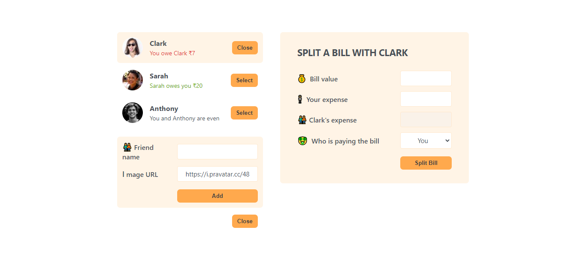

# 👥 Eat N Split

This project is a simple **React** application that allows users to split bills and track expenses with friends. It's a great tool to keep track of how much you owe or how much your friends owe you! 💸

## 📸 Screenshot



## 📋 Features

- 📃 **Add Friends**: Add your friends with a name and a picture to keep track of your expenses with them.
- 💰 **Split Bills**: Enter the bill amount and your expense, then see how much your friend owes or how much you owe your friend.
- 🔄 **Track Balances**: Easily track who owes what — the app automatically calculates and updates the balance.
- 🖼️ **Custom Friend Avatars**: Each friend can have a unique avatar pulled from an online service.

## 🛠️ How It Works

1. **Add a Friend**: Click the `Add Friend` button, fill in the name and image URL, and submit to add a friend.
2. **Select a Friend**: From the sidebar, click on a friend to open the bill-splitting form.
3. **Enter Bill Details**: Input the bill total and your expense, then select who paid.
4. **See the Balance**: The app will show whether your friend owes you or if you owe them, with updated balances.

## 🧰 Technologies Used

- **React** ⚛️: Used to build the entire user interface.
- **JavaScript**: The logic behind the bill splitting and balance calculations.
- **CSS** 🎨: Simple styling to make the app user-friendly and visually appealing.

## 🚀 Getting Started

1. **Clone the repository**:
   ```bash
   git clone https://github.com/your-username/friends-expense-tracker.git
   ```
2. **Install dependencies**:
   ```bash
   npm install
   ```
3. **Start the development server**:
   ```bash
   npm start
   ```

## 🖥️ Usage

- Once the app is running, you'll see a sidebar with your friends.
- To add a friend, click on the Add Friend button. Enter the friend's name and an image URL.
- Select the friend from the list, and you’ll see an option to split a bill with them.
- After entering the bill amount and the respective expenses, the balance will be updated.
